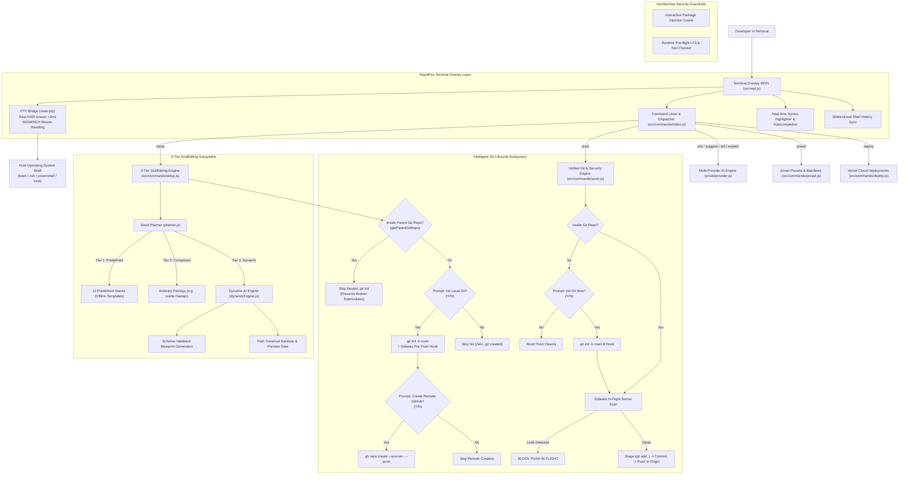
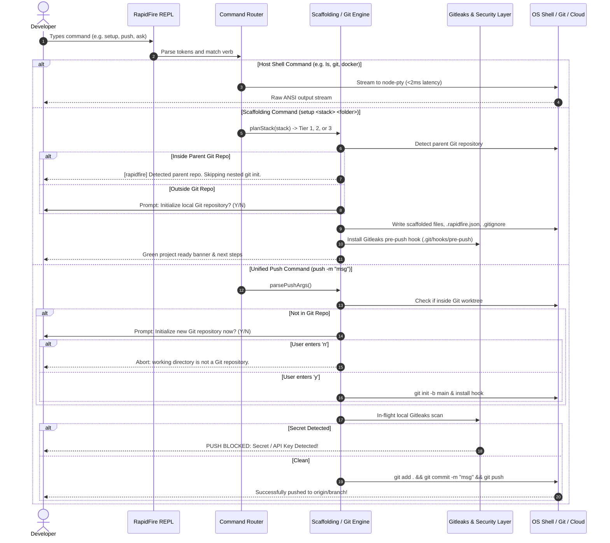

# RapidFire CLI

[](https://www.npmjs.com/package/rapidfire-cli)
[](https://opensource.org/licenses/MIT)
[](https://nodejs.org)
[](https://github.com/VsrCube/Rapidfire-Cli)
[-success.svg?style=flat-square)](https://github.com/VsrCube/Rapidfire-Cli)

**The Developer Terminal Overlay & Full-Stack Scaffolding Workspace**

RapidFire is a lightweight terminal overlay and interactive developer environment that supercharges your existing shell (PowerShell, Bash, or Zsh). It bridges the gap between terminal productivity, local project scaffolding, and AI assistance: scaffold production-grade full-stack architectures in under 3 seconds, install AI-recommended packages with one keystroke, scan for leaked secrets before every push via GitLeaks, and execute unified Git workflows across branches without leaving your terminal.

[Requirements](#system-requirements--prerequisites) • [Installation & Removal](#installation--uninstallation-guide) • [What RapidFire Solves](#what-rapidfire-solves-in-practice) • [Interactive Package Installer](#interactive-in-terminal-package-installer) • [Security Guardrails](#enterprise-grade-security-guardrails) • [Commands](#command-reference)

---

## Table of Contents

| # | Section | Overview & Key Capabilities | Navigation |
|---|---|---|:---:|
| 01 | **What RapidFire Solves in Practice** | Real-world developer workflow comparison, native PTY shell passthrough | [View](#what-rapidfire-solves-in-practice) |
| 02 | **Architecture & Value Proposition** | Persistent terminal overlay, zero-cloud architecture, local dev environment | [View](#architecture--value-proposition) |
| 03 | **System Requirements & Prerequisites** | Node.js, npm, supported operating systems, optional tools & runtime matrix | [View](#system-requirements--prerequisites) |
| 04 | **Cost & Local Execution FAQ** | 100% free pricing model, local execution details, API key ownership | [View](#cost--local-execution-faq) |
| 05 | **Installation & Uninstallation Guide** | Global npm setup, update commands, developer clone, complete clean removal | [View](#installation--uninstallation-guide) |
| 06 | **In-Terminal Package Installer** | Contextual dependency detection, injection protection, 1-click install | [View](#interactive-in-terminal-package-installer) |
| 07 | **Enterprise-Grade Security Guardrails** | GitLeaks pre-push scanner, package regex checks, preview approvals | [View](#enterprise-grade-security-guardrails) |
| 08 | **Scaffolding Recipes & LTS Stack** | 13 connected & standalone frameworks, pinned LTS runtimes, pre-flight checks | [View](#scaffolding-recipes--lts-stack) |
| 09 | **AI Provider & API Key Management** | Pluggable providers (Groq, OpenAI, Gemini, Ollama), auto key detection | [View](#ai-provider--api-key-management) |
| 10 | **Unified Git & GitHub Automation** | Single-command staging, commit, push, branch management & auto `gh` repo | [View](#unified-git--github-automation) |
| 11 | **Bidirectional History & Highlighting** | Bidirectional shell history sync (Bash/Zsh/PowerShell), live syntax highlighting | [View](#bidirectional-terminal-history--real-time-highlighting) |
| 12 | **Command Reference** | Comprehensive quick-reference table for all RapidFire commands | [View](#command-reference) |
| 13 | **Testing & Verification** | 24 automated test suites, simulated remotes, security audit checks | [View](#testing--verification) |
| 14 | **License** | Open-source MIT license details | [View](#license) |

---

## What RapidFire Solves in Practice

Starting a modern web or backend project typically requires juggling disconnected tools: searching for template repos, cloning bloated starters, configuring CORS and environment variables, initializing Git, setting up Python virtual environments, looking up npm/pip packages on the web, worrying about committing secret keys, and managing branch checkouts.

RapidFire brings this entire setup lifecycle into a single interactive terminal:

```
TRADITIONAL DEVELOPER WORKFLOW:
  1. Open browser -> Search Vite/FastAPI boilerplate
  2. git clone -> Remove author's git history -> npm install
  3. Manually write CORS headers, port configurations, and proxy settings
  4. Manually run python -m venv .venv -> activate -> install requirements
  5. Search StackOverflow for package recommendations
  6. Copy-paste npm install commands into terminal
  7. Risk accidentally committing .env or API keys
  8. Type git add . -> git commit -m "..." -> git checkout -b ... -> git push -u origin ...

WITH RAPIDFIRE CLI:
  1. rapidfire
  2. setup react+fastapi my-app  (Scaffolded, CORS-connected, git-ready in 2 seconds)
  3. ask "How do I add JWT auth and validate schemas?"
     -> RapidFire answers and detects packages: pyjwt, pydantic
     -> Prompt: Select packages (1,2 or all): 1,2 -> Installed & verified!
  4. Automatic GitLeaks hook blocks any secret keys before push
  5. git add . push -b feature1 -commit "Add auth layer" (Staged, committed, pushed!)
```

### Native Shell Passthrough
RapidFire is **not** an isolated sandbox. It wraps your native shell (`powershell.exe` / `pwsh` on Windows, `/bin/zsh` on macOS, `/bin/bash` or `pwsh` on Linux) inside a persistent PTY.
- Standard shell commands (`cd`, `ls`, `git`, `npm`, `python`, `pip`, `docker`, `docker compose`, `curl`, `code .`) run directly with complete fidelity.
- Working directory changes (`cd`) and environment variable state persist across commands.
- Long-running processes (`npm start`, `npm run dev`, `docker build`) stream in real time and can be stopped at any time with `Ctrl+C`.

---

## Architecture & Value Proposition

RapidFire executes 100% locally on your computer with zero telemetry and zero cloud dependencies. It orchestrates native PTY terminal execution, 3-tier scaffolding, local secret detection, and unified Git workflows.

### System Architecture & Subsystem Diagram



### End-to-End System Data Flow



```
+------------------------------------------------------------------------------+
|                           RAPIDFIRE DEVELOPER SHELL                          |
+-------------------------------+----------------------------------------------+
| 3-Tier Dynamic Scaffolder     | Pluggable AI Assistant                       |
|  * 13 Built-in Stack Recipes  |  * ask: Multi-turn Q&A + 1-Click Installer   |
|  * Composed Arbitrary Pairs   |  * suggest: Interactive (Y/N) Stack Planner  |
|  * Dynamic AI Blueprinting    |  * tell: Multi-file Generation with Preview  |
|  * Proactive Runtime Checks   |  * explain: Codebase & File Architecture     |
|  * Auto Python venv Prompt    |  * Persistent Local Key Storage (0600)       |
+-------------------------------+----------------------------------------------+
| 5-Pillar Security Suite       | Productivity & Automation                    |
|  * Automated GitLeaks Hook    |  * Bidirectional Shell History (PS/Bash/Zsh) |
|  * PyPI & npm Registry Checks |  * Real-Time Syntax Highlighting & Complete  |
|  * Path Traversal Defense     |  * Workspace Presets & Structure Snapshots   |
|  * Safe Deployment Approvals  |  * Unified Git Push & Auto-Rebase Recovery   |
|  * Clean Git Verification     |  * Auto Remote Repo Linking (gh CLI)         |
+-------------------------------+----------------------------------------------+
```

---

## System Requirements & Prerequisites

RapidFire is designed to run seamlessly across all major platforms with minimal prerequisites:

### Core Runtime Matrix
| Requirement | Minimum Version | Recommended Version | Purpose |
|---|---|---|---|
| **Node.js** | `>= 18.0.0` | `20.x` or `22.x` LTS | Core CLI runtime engine |
| **npm** | `>= 9.0.0` | `10.x` or `11.x` | Package installation & global binary linking |

### Supported Operating Systems
* **Windows**: Windows 10 or Windows 11 (Supports Windows PowerShell 5.1+, PowerShell 7 `pwsh`, and CMD).
* **macOS**: macOS 12 (Monterey) or higher (Supports default `/bin/zsh` and `/bin/bash`).
* **Linux**: Any standard modern distribution (Ubuntu, Debian, Fedora, Arch Linux, CentOS, openSUSE) with `bash`, `zsh`, or `pwsh`.

### Note on npm 11+ Install Warnings (`allow-scripts`)
When installing RapidFire on modern npm versions (v11+), you may see a harmless notification:
```text
npm warn allow-scripts 1 package has install scripts not yet covered by allowScripts: node-pty
```
**This is not an error.** It is an npm 11+ security notice informing you that the terminal driver (`node-pty`) includes standard build scripts. The package is fully installed. RapidFire also includes an automatic standard `spawn` adapter that runs out of the box even in environments where native C++ compilation is unavailable.

### Optional Developer Tools (Recommended for Full Feature Set)
While RapidFire works immediately for terminal operations and scaffolding, these tools unlock its full automation:
* **Git** (`git`): Recommended for repository initialization, pre-push secret scanning, and the unified `git add . push` command.
* **Python 3** (`python` / `python3`) + `pip`: Required if you intend to scaffold and run Python stacks (FastAPI, Django, Flask).
* **GitHub CLI** (`gh`): Allows RapidFire to automatically create public/private GitHub repositories and link remote origins with zero browser visits.
* **GitLeaks** (`gitleaks`): Enables automated scanning for leaked API keys and tokens in `.git/hooks/pre-push`.
* **Vercel CLI** (`vercel`): Enables the one-command production frontend deployment workflow (`deploy vercel`).

---

## Cost & Local Execution FAQ

### Is RapidFire a cloud service? Does it cost money?
**No. RapidFire is 100% Free and Open Source ($0.00). It runs entirely on your local machine.**

| Question | Answer |
|---|---|
| **Does it run in the cloud?** | **No.** RapidFire runs locally on your machine using your local Node.js runtime and shell PTY. |
| **Are there any server costs?** | **$0.00.** There are no hosted servers, no subscriptions, and no credit card requirements. |
| **Does the AI cost anything?** | **No.** RapidFire supports free-tier API keys (such as Groq's high-speed free tier) as well as 100% free offline local models (via Ollama). You can use all features at zero cost. |
| **Where is my data stored?** | **100% on your machine.** Your API keys, history, and workspace presets are saved locally in `~/.rapidfire/config.json`. No project code, telemetry, or user information is transmitted to external servers. |

---

## Installation & Uninstallation Guide

### Global Installation
Install RapidFire system-wide using npm:

```bash
npm install -g rapidfire-cli
```

Once installed, launch RapidFire from **any directory or terminal**:
```bash
rapidfire
# or
rapidfire-cli
```

### Updating to the Latest Release
To update your existing global installation to the newest version:
```bash
npm install -g rapidfire-cli@latest
```

### Local Developer Clone
If you are developing or contributing to the RapidFire codebase:
```bash
git clone https://github.com/VsrCube/Rapidfire-Cli.git
cd Rapidfire-Cli
npm install
npm test      # Runs all 26 automated test suites
npm start     # Starts local REPL
```

### Complete Uninstallation & Clean Removal
If you ever wish to remove RapidFire and all associated local configuration from your system:

#### Step 1: Remove the Global Package
```bash
npm uninstall -g rapidfire-cli
```

#### Step 2: Delete Configuration, Keys & Saved Presets
RapidFire stores your API key and custom presets in your local user directory under `~/.rapidfire`. To erase all local configuration:

* **Linux & macOS**:
  ```bash
  rm -rf ~/.rapidfire
  ```

* **Windows (PowerShell)**:
  ```powershell
  Remove-Item -Recurse -Force ~/.rapidfire
  ```

* **Windows (Command Prompt / CMD)**:
  ```cmd
  rmdir /s /q "%USERPROFILE%\.rapidfire"
  ```

---

## Interactive In-Terminal Package Installer

One of RapidFire's core productivity features is its **Autonomous Dependency Detection & One-Click Installer** inside the `ask` command.

When you ask RapidFire a technical question:
```text
rapidfire> ask "How do I make HTTP requests in React and format dates?"
```

RapidFire's AI analyzes your query and responds with implementation guidance. Concurrently, RapidFire parses the response for recommended `npm` or `pip` dependencies and presents an interactive installation checklist directly in your terminal:

```text
+-- Suggested Node (npm) Packages Detected -------------------------+
  [1]   axios
  [2]   date-fns
+-------------------------------------------------------------------+

Select packages to install (e.g. 1,2 or 'all' or press Enter to skip): 1,2

Selected packages: axios, date-fns
Confirm installation? (Y/N): Y

[rapidfire-security] Verifying package safety & registry integrity...
  [OK] VERIFIED: axios
  [OK] VERIFIED: date-fns

[rapidfire] Installing 2 verified packages via npm...
[OK] Successfully installed: axios, date-fns
```

### Why this is safer than manual terminal installation:
1. **Interactive Multi-Select**: Enter `1,2`, `all`, or press `Enter` to skip without running any commands.
2. **Live Registry Verification**: RapidFire queries the official PyPI (`pypi.org`) or npm registry (`registry.npmjs.org`) to confirm each package exists before running install commands.
3. **Injection & Typo Shield**: Package names with invalid characters, directory traversals, or flag injections (e.g., `--extra-index-url`) are strictly blocked.

---

## Enterprise-Grade Security Guardrails

RapidFire is built with defensive engineering principles across **5 security pillars**:

```
+-----------------------------------------------------------------------------+
|                       5 PILLARS OF RAPIDFIRE SECURITY                       |
+-----------------------------------------------------------------------------+
| 1. GitLeaks Secret Protection        -> Automated pre-push git hook         |
| 2. Package Registry Verification     -> Injection shield & PyPI/npm checks  |
| 3. Path Traversal & File Safety      -> Sanitized paths & preview approvals |
| 4. Guarded Cloud Deployment          -> Clean git check & manual Y/N prompt |
| 5. Local Credential Isolation        -> Masked keys & restricted 0600 perms |
+-----------------------------------------------------------------------------+
```

### 1. GitLeaks Pre-Push Secret Scanning
* Every project scaffolded with `setup` or initialized with `init` automatically initializes Git and installs a **`.git/hooks/pre-push`** security hook.
* Before any code is pushed to a remote repository (`git push`), RapidFire scans outgoing commit diffs for exposed credentials (API keys, private keys, AWS tokens, GitHub PATs).
* If sensitive credentials are detected, the push is immediately halted, preventing security leaks before they reach the web.

### 2. Dependency Injection & Typo-Squatting Defense
* When installing packages via the interactive installer, RapidFire validates package identifiers against a strict regex whitelist (`/^[a-zA-Z0-9_\-\.]+$/`).
* Flags (starting with `-`), directory traversals (`..`), or abnormal strings are rejected.
* Live registry queries verify the package belongs to the legitimate registry before spawning `npm install` or `pip install`.

### 3. Safe Generative Code Writing (`tell`)
* When using `tell <instruction>` to generate code files:
  - RapidFire inspects proposed file paths to ensure they remain inside the active project directory. Path traversals (`../`) outside the workspace root are blocked.
  - Displays a structured generation preview (showing all files and line counts) and requires explicit confirmation: `Confirm file generation? (Y/N): `.

### 4. Guarded Production Deployments (`deploy`)
* The `deploy vercel` command never executes silently.
* RapidFire first verifies that the Git working tree is clean so untracked secrets or staging files are not accidentally deployed.
* Requires explicit user verification (`Confirm Vercel deployment? (Y/N): `) before calling the Vercel CLI.

### 5. Local Credential Privacy
* Your AI API key is stored strictly on your local filesystem at `~/.rapidfire/config.json` with restricted permissions (`0600` on POSIX systems).
* Commands like `key status` mask your key (e.g., `sk-...1234` or `gsk_...1234`) to protect against shoulder-surfing during screen shares.

---

## Scaffolding Recipes & The 3-Tier Dynamic Engine

RapidFire does not limit developers to static templates. Its scaffolding subsystem operates across **three progressive tiers**:

```
[setup <stack> <folder>]
         |
         +--> Tier 1: Built-in Predefined Recipes (13 exact matches)
         |            • Instant, offline, embedded fallbacks
         |
         +--> Tier 2: Dynamic Composed Pairings (e.g. svelte+fastapi, vue+flask)
         |            • Combines modular frontend & backend adapters
         |            • Wires CORS, ports, and manifests automatically
         |
         +--> Tier 3: Dynamic Unknown Frameworks (e.g. hono, astro, solid, nextjs, nestjs)
                      • Generates structured blueprint via AI / ecosystem starters
                      • Displays terminal file preview & requires explicit [Y/N] approval
                      • Injects .rapidfire.json (generationMode: "dynamic") + Gitleaks
```

### Full-Stack Connected Recipes (Tier 1 & 2)
| Recipe Command | Frontend | Backend | Features |
|---|---|---|---|
| `setup react+fastapi <dir>` | React 18 LTS (Vite) | Python FastAPI | Connected CORS, auto Swagger docs (`/docs`) |
| `setup react+django <dir>` | React 18 LTS (Vite) | Django LTS REST | Ready-to-use Django REST API & SQLite models |
| `setup react+node <dir>` | React 18 LTS (Vite) | Express 4 LTS | Concurrent dev scripts, CORS pre-configured |
| `setup vue+fastapi <dir>` | Vue 3 LTS (Vite) | Python FastAPI | Interactive Vue 3 UI + FastAPI backend |
| `setup vue+node <dir>` | Vue 3 LTS (Vite) | Express 4 LTS | Full-stack JavaScript/Node architecture |
| `setup vue+django <dir>` | Vue 3 LTS (Vite) | Django LTS REST | Vue 3 SPA + Django REST framework |
| `setup react+flask <dir>` | React 18 LTS (Vite) | Python Flask | Lightweight Python REST endpoints |
| `setup svelte+node <dir>` | Svelte (Vite) | Express 4 LTS | High-performance reactive UI + Express API |
| `setup <fe>+<be> <dir>` | Any Frontend | Any Backend | Arbitrary pairing (e.g., `setup svelte+fastapi myapp`) |

### Standalone & Dynamic Frameworks (Tier 1 & 3)
| Recipe Command | Framework | Details |
|---|---|---|
| `setup react <dir>` | React (Vite) | React 18 LTS (`^18.3.1`) |
| `setup vue <dir>` | Vue 3 (Vite) | Vue 3 LTS (`^3.5.0`) |
| `setup svelte <dir>` | Svelte (Vite) | Modern Vite Svelte SPA |
| `setup fastapi <dir>` | FastAPI | `fastapi>=0.115.0`, `uvicorn>=0.32.0` |
| `setup django <dir>` | Django | Official Django LTS (`Django>=4.2,<6.0`) |
| `setup <unknown> <dir>` | Custom / Unknown | Dynamic AI blueprinting (e.g., `hono`, `astro`, `solid`, `nextjs`) |

### Automated Python Virtual Environment Setup
When scaffolding any Python stack (FastAPI, Django, Flask), RapidFire asks:
```text
Would you like RapidFire to create an isolated Python virtual environment (.venv)? (Y/N):
```
If confirmed, RapidFire creates `.venv`, updates `pip`, installs `requirements.txt`, and generates platform-specific activation scripts (`activate.bat`, `Activate.ps1`, `activate.sh`).

### Proactive Runtime Pre-Flight Checks
Before touching your filesystem, RapidFire runs runtime diagnostics:
- Verifies **Node.js LTS** (`>=18.0.0`) and **npm** are available.
- Verifies **Python 3** and **Django CLI** for Python-based stacks.
- If a required runtime is missing, RapidFire cleanly halts and outputs copy-paste installation commands tailored specifically to your operating system (Windows `winget`, macOS `brew`, Linux `apt`/`dnf`/`pacman`).

---

## AI Provider & API Key Management

RapidFire features a pluggable AI subsystem with automatic key detection. Just paste your API key—RapidFire auto-detects the provider and configures the optimal model:

* **Groq** (`gsk_...`) -> Free-tier `llama-3.3-70b-versatile`
* **OpenAI** (`sk-...`) -> Fast `gpt-4o-mini`
* **Gemini** (`AIza...`) -> Fast `gemini-2.5-flash`
* **Ollama / Custom** -> Local or custom OpenAI-compatible endpoints (`http://localhost:11434/v1`)

```bash
# Save or update your key (auto-detects provider & default model)
key <your_api_key>

# View active provider, model, masked key, and config source
key status

# Optional: Override the default model
key model <model-name>

# Remove saved credentials
key clear
```

### Conversational Memory & Code Understanding
- `ask <question>`: Technical Q&A with multi-turn conversation memory.
- `ask clear`: Reset conversation memory.
- `explain [path]`: Explain file architecture or directory trees (`explain src/repl.js` or `explain .`).
- `suggest <description>`: Recommends full-stack architectures with interactive `(Y/N)` scaffolding confirmation.
- `tell <instruction>`: Generates multi-file code structures with plan preview and safety approval.

---

## Unified Git & GitHub Automation

RapidFire unifies staging, committing, and pushing into a single, intuitive command:

```bash
git add <files> push [-b <branch>|-m] -commit "<message>"
```

### Key Capabilities
* **Flexible Staging**: Stage all files with `.` or stage individual files (e.g., `git add README.md ...` or `git add src/app.js ...`).
* **Active Branch (Default)**: If no branch flag is specified, RapidFire automatically stages, commits, and pushes to your current active branch.
* **Targeting the Main Branch**: Target `main` directly from any branch using `-m` or `-main` when paired with `-commit` (e.g., `git add . push -m -commit "message"`).
* **Targeting Specific Branches**:
  * Standalone branch flag: `push -b feature1 -commit "message"`
  * Attached branch shorthand: `push -branch3 -commit "message"` or `push -b3 -commit "message"`
  * Typo tolerance: `push -brach3 -commit "message"` or `push -brach feature1 -commit "message"`
  * If the target branch does not exist locally, RapidFire automatically creates it with `git checkout -b <branch>` and pushes upstream.
  * If uncommitted working tree changes exist, RapidFire stashes changes safely before switching and pops them cleanly.
* **Commit Message**: Use `-commit "<message>"` or standard `-m "<message>"` (when not targeting a branch). Compound flags like `-m -commit "<message>"` target `main` with the specified commit message.
* **Automatic Rebase Recovery**: If remote `origin` has newer commits (non-fast-forward rejection), RapidFire automatically syncs via `git pull --rebase` and retries the push.
* **Automatic GitHub Repo Provisioning**: If the local repository lacks a configured remote origin, RapidFire proactively detects your `gh` CLI credentials, prompts to create the GitHub repository, and sets the upstream tracking branch automatically.

### Intelligent Git Lifecycle & Nested Git Prevention

RapidFire solves the classic nested repository dilemma that occurs when developers scaffold multiple projects or submodules (like creating `frontend/` and `backend/` independently):

* **Nested Git Guard**: Inspects parent directory hierarchies before `git init`. If an existing Git repository is detected, RapidFire skips creating nested `.git` folders so the parent repository tracks the files cleanly without submodule corruption.
* **On-Demand Local Git Initialization**: Standalone projects outside any repository prompt: `Do you want to initialize a local Git repository for '<folder>'? (Y/N): `. Declining leaves the folder completely clean without `.git`.
* **On-Demand Push Initialization**: Executing `push` in a non-git directory prompts for confirmation before initializing `main` and installing security hooks; if declined, the push aborts safely.

### Command Examples
```bash
# Push directly to main from any branch
git add . push -m -commit "Add server module"

# Push all files to the current active branch
git add . push -m "Add server module"

# Push all files to a new or existing feature branch
git add . push -b branch1 -commit "new feature"

# Attached branch shorthand
git add . push -branch3 -commit "testing branch push"

# Push with branch and -m commit message
git add . push -b feature1 -m "Add user profile components"

# Shorthand for main branch
git add . push -main -commit "production update"

# Push a single file with commit message
git add README.md push -m -commit "updated documentation"
```

---

## Bidirectional Terminal History & Real-Time Highlighting

RapidFire seamlessly synchronizes command history across your host operating system and active shell environment:

* **Instant Up-Arrow Recall**: When you launch RapidFire, pressing Up Arrow immediately cycles through commands previously executed in your normal terminal.
* **Session Persistence**: When you exit RapidFire, all commands executed during your session are automatically saved back to your host shell's history file.
* **Cross-Platform Host Support**:
  * **Windows**: PowerShell PSReadLine (`ConsoleHost_history.txt`)
  * **macOS**: Zsh (`~/.zsh_history`)
  * **Linux**: Bash (`~/.bash_history`), PowerShell (`pwsh`)
  * **RapidFire Dedicated Store**: Persistent fallback in `~/.rapidfire/history.txt`
* **Real-Time Keystroke Highlighting**: Commands, subcommands, flags, and strings highlight on every character insertion without delay, styled after PowerShell PSReadLine themes.

---

## Command Reference

| Command | Category | Description |
|---|---|---|
| `help` | General | Display the interactive command manual |
| `init` / `setup <recipe> <folder>` | Scaffolding | Scaffold any of the 13 built-in full-stack projects or initialize RapidFire |
| `setup <fe>+<be> <folder>` | Dynamic Scaffolding | Dynamically compose unlisted pairings (e.g. `setup svelte+fastapi myapp`) |
| `setup <unknown> <folder>` | AI Scaffolding | Dynamically scaffold unknown frameworks (e.g. `hono`, `astro`, `solid`, `nextjs`) |
| `explain [path]` | AI Analysis | Explains codebase architecture, folder tree, or source file role |
| `ask <question>` | AI Companion | Technical Q&A with conversational memory & 1-click package installer |
| `ask clear` | AI Companion | Clear conversation context memory |
| `suggest <description>` | AI Companion | Recommends optimal architecture with interactive `(Y/N)` scaffold prompt |
| `tell <instruction>` | AI Generation | Generates code and files with plan preview & `(Y/N)` safety approval |
| `key <api-key>` | Configuration | Save or change your AI API key (auto-detects provider) |
| `key status` | Configuration | Display active AI provider, model, masked key, and source |
| `key model <name>` | Configuration | Override active AI model (e.g. `key model gpt-4o-mini`) |
| `key clear` | Configuration | Remove stored AI credentials from local config |
| `save preset <name> [folder]` | Presets | Serialize project files & manifest into `~/.rapidfire/presets/<name>.json` |
| `load preset <name> <folder>` | Presets | Recreate project structure & files from a saved preset |
| `presets` / `list presets` | Presets | List all saved workspace presets |
| `deploy vercel` | Deployment | Deploy frontend to Vercel production with clean git check & manual confirmation |
| `git add <files> push [-b <branch>\|-m] -commit "<msg>"` | Git Automation | Stage specific files or `.`, commit, and push in one unified command |
| `exit` / `quit` | Session | Exit RapidFire cleanly |
| *any shell command* | PTY Shell | Native passthrough (`cd`, `ls`, `git`, `npm`, `python`, `docker`, `curl`) |

---

## Testing & Verification

RapidFire maintains a rigorous automated testing suite covering all 13 framework recipes, shell passthrough, AI fallbacks, cross-platform paths, prompt restoration, nested git prevention, and security scanners:

```bash
npm test
```

```text
======================================================
Summary: 26 passed, 0 failed (26 total)
======================================================
ALL 26 TEST SUITES PASSED FLAWLESSLY!
```

---

## License

MIT (c) Vedansh Shrivastava ([@VsrCube](https://github.com/VsrCube))
